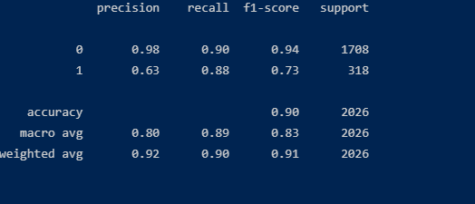

# Bank Churning Classifier

## About:

Bank Churning Classifier is a model that uses customer bank data to classify potential credit card churner based on SMOTE and Random Forest. The model uses kaggle credit card customer dataset for analysis and training but can be adapted to other sytems with some changes.

## Motivation
The motivation for this model came from my intrest in credit cards and how some companies accept and reject each customers service. I wanted to know what quantative factors that caused you to become to be labeled a churner since many bussiness in this sector do this hunrdred to thousand of time a week. The goal was to create model that take a input and predict if they are a churner or good existing customer.   

## Quick Start
### Python
- Use python 3.9+

### Libraries
- Install python packages using pip:
  - numpy,seaborn,matplotlib,scikit-learn,pandas

## Methodology
  ### Cleaning
  - Cleaned unnecessary information on the dataset, null values, unknowns, and other variables.
  - Check if our data types are correct and perform the operations to change them from object into a category while also creating ranges for each feature.
  - Our dataset has a problem with imbalanced data, we use SMOTE algorithm to help with this issue. SMOTE is an algorithm that produces synthetic information using k-nearest to help solve the imbalance in datasets.

### Data Exploration
- Created a correlation matrix to find linearly coreleated data
- Normalize data using minimax scaler
- Made the random forest model using a split of 75/25 training and validation.
- created a confusion matrix map to analysis it performance
- 

### Results and improvements for future.
- In the test of our model, we got a 94 percent accuracy score against our test dataset but with a lot of doubt on accuracy.
- Inspecting further precision-recall and f1 for our non-churn detection is exceedingly high but our numbers for our churners are far less dependable
- This could be due to the imbalance and points to more experimentation needed to close the gap further. A different classification algorithm or even fine-tuning our features to make the dataset cleaner.

## dataset resouces:
- [customer churner dataset](https://www.kaggle.com/vivek468/will-the-customer-churn#5)